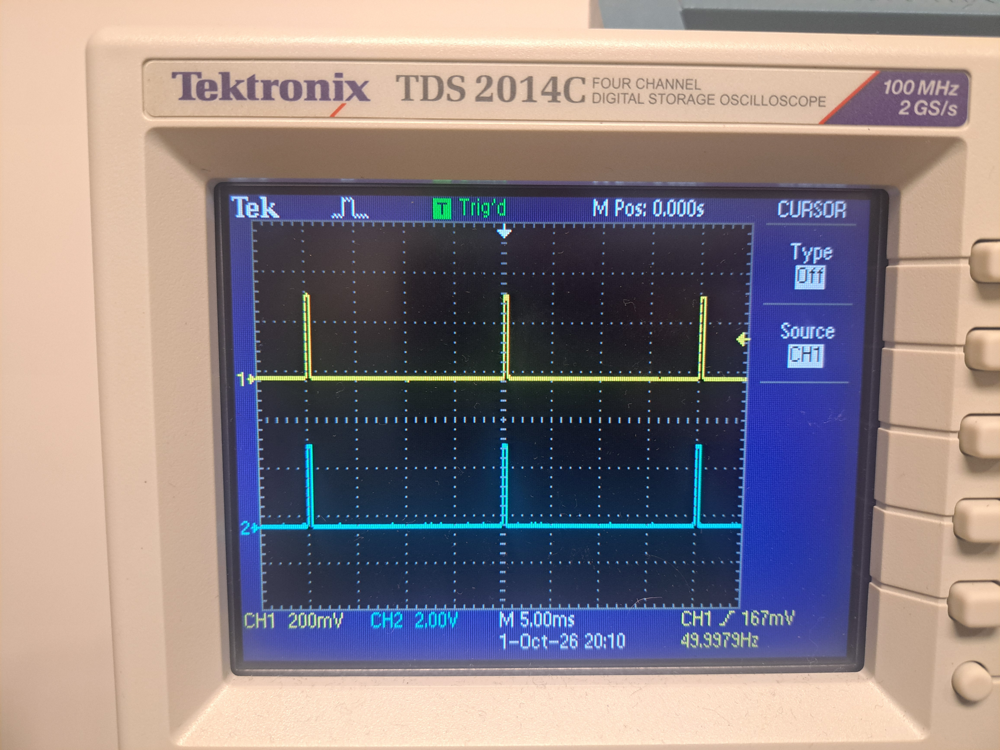
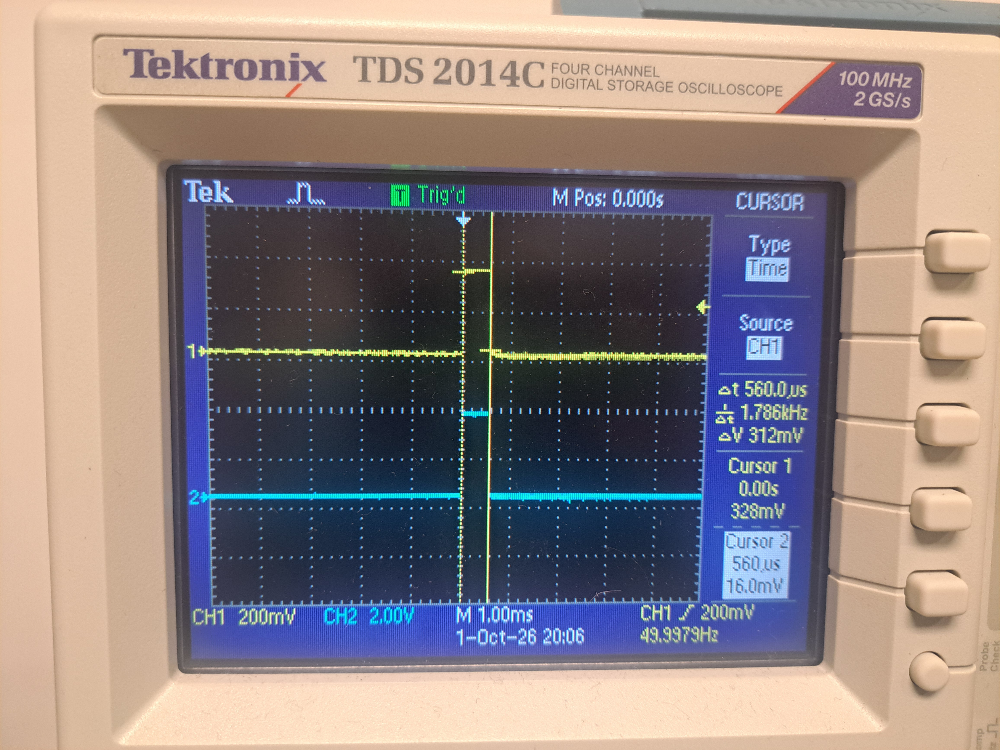
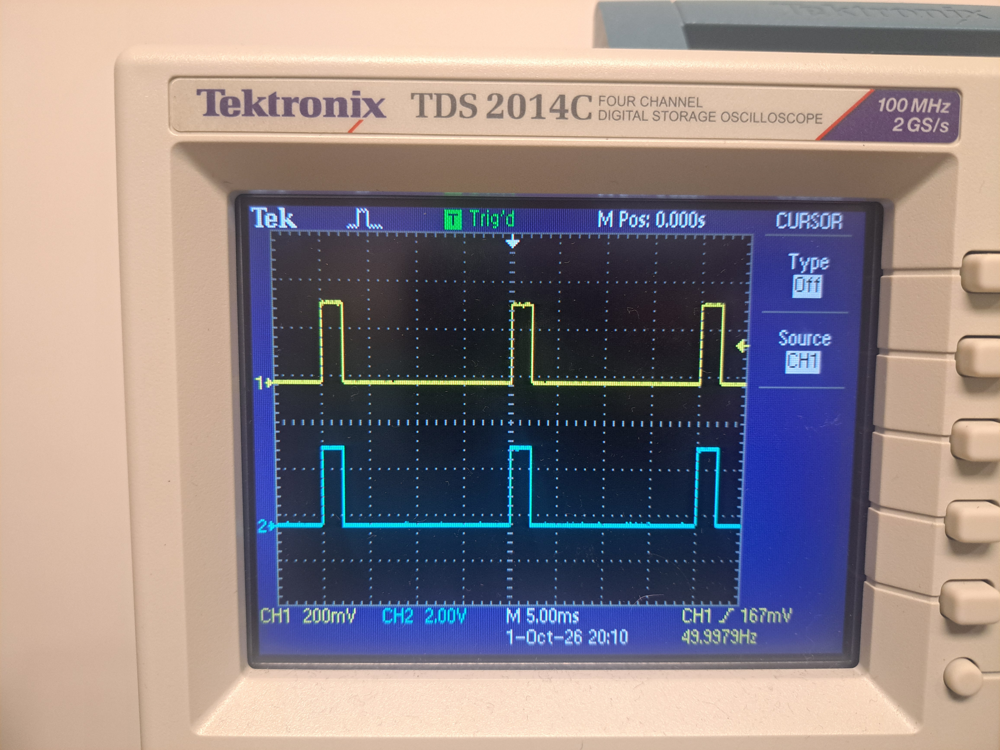
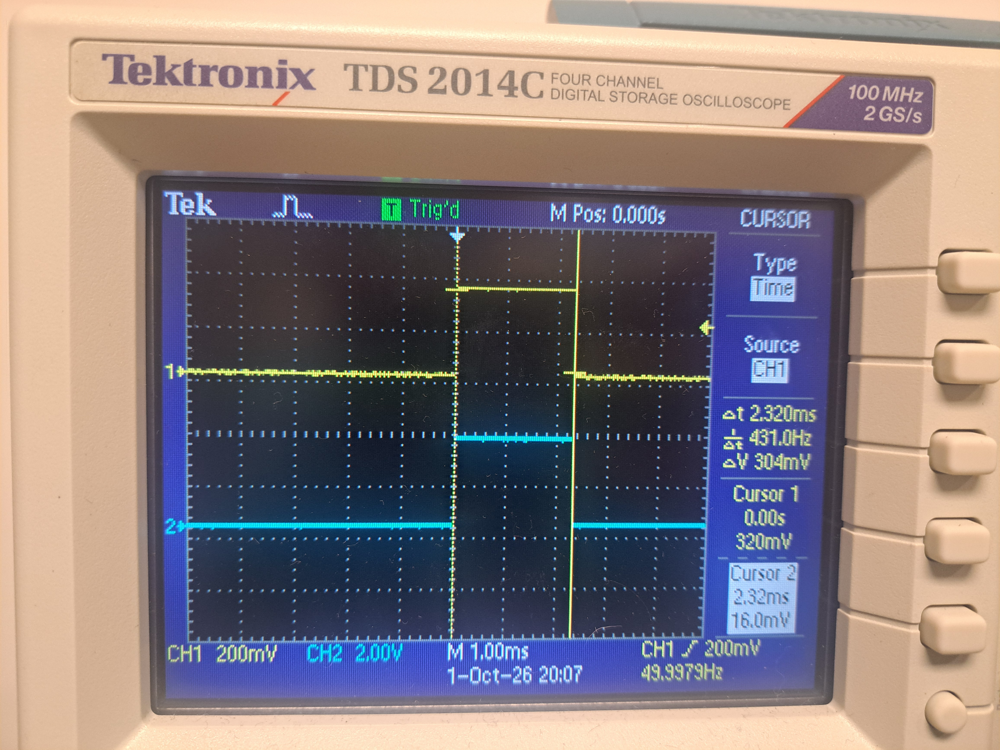
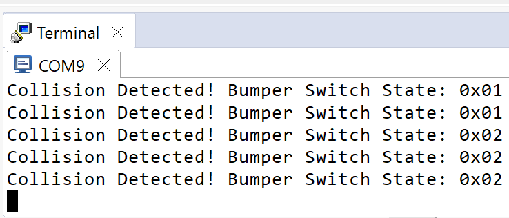
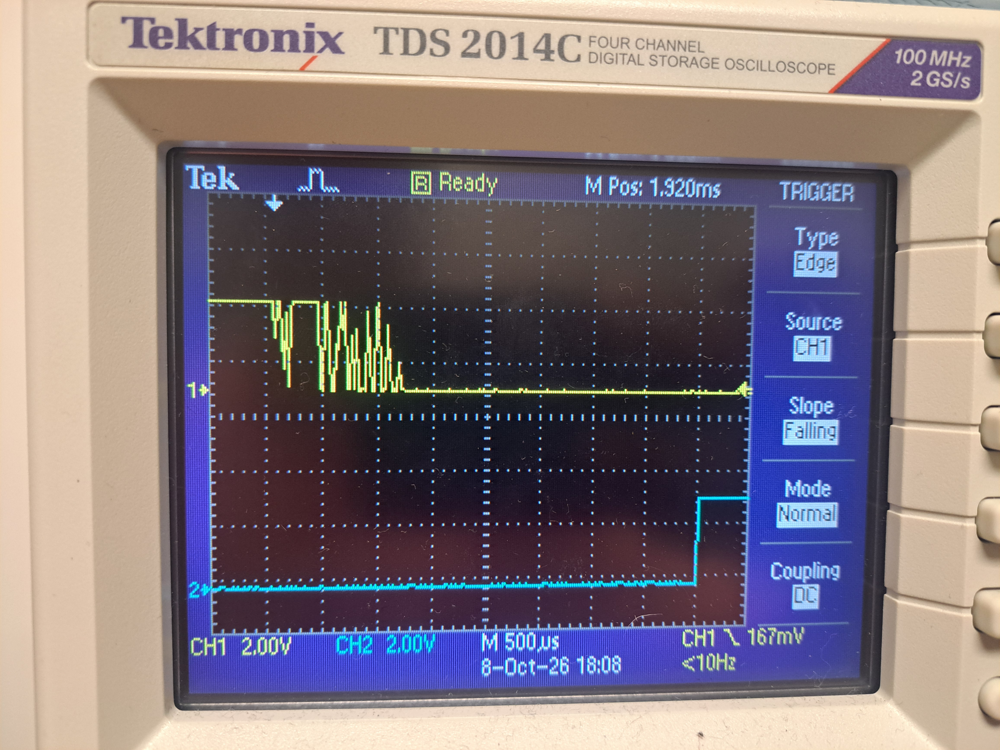

# ECE 528/L - Robotics and Embedded Systems with Lab
**CSU Northridge**

**Department of Electrical and Computer Engineering**

## Motor Control Lab
The Motor Control lab interfaces with the following:

* User LEDs of the TI MSP432 LaunchPad
* Pololu Gearmotor with Encoder - [Product Link](https://www.pololu.com/product/3675)
* Left Bumper Switches for TI-RSLK MAX - [Product Link](https://www.pololu.com/product/3673)
* Right Bumper Switches for TI-RSLK MAX - [Product Link](https://www.pololu.com/product/3674)
* HS-485HB Servo-Stock Rotation - [Product Link](https://www.servocity.com/hs-485hb-servo/)

## 1. Overview

This lab introduced students to the concept of Pulse Width Modulation, or PWM, and edge-triggered interrupts. It demonstrates how to configure Timer_A to generate PWM signals and set up GPIO pins to use edge-triggered interrupts. The PWM signals generated by Timer A will be used to drive both DC motors and servos.

This lab also shows how to handle collision events using the bumper switches that are located at the front side of the TI-RSLK MAX chassis. Students implemented a function that will move the robot in a predefined drive pattern when it detects a collision. In addition, students verified the PWM signals generated by Timer A and also observe the bouncing effect of the bumper switches using an oscilloscope.

## 2. Components Used

- 1 MSP432 Launchpad
- 1 USB-A to Micro-USB Cable
- 1 TI-RSLK MAX Chassis
- 2 Bumper Switches
- 2 HS-485HB Servos
- 1 Oscilloscope
- 2 Oscilloscope Probes

## 3. Analysis and Results

Following the intial procedures set in section 5, has led to the following Oscilloscope captures and terminal output.

### Screenshots / Waveforms / Diagrams

**Figure 1: [File name: ece528L_lab1_servo_0_degrees_Steve_Ortiz]**

**Figure 2: [File name: ece528L_lab1_servo_0_degrees_pulse_width_Steve_Ortiz]**

**Figure 3: [File name: ece528L_lab1_servo_180_degrees_Steve_Ortiz]**

**Figure 4: [File name: ece528L_lab1_servo_180_degrees_pulse_width_Steve_Ortiz]**

**Figure 5: [File name: ece528L_lab1_bumper_terminal_output_Steve_Ortiz]**

**Figure 6: [File name: ece528L_lab1_bumper_scope_shot_Steve_Ortiz]**

## 4. Known Issues or Limitations

The main limitation surrounding the lab was a principle lack of understanding surrounding the syntax used for C. Namely the initial concepts used for referencing pointers, and utilizing them to alter bits. Once a comprehensive review of previously recorded lectures, notes, and staring session of the code had been completed, understanding soon followed.

There were 2 main issues encountered, an uncooperative non-blinking red light, and a burnt motor. The motor had been burnt as a result of connecting the motor to active power and signal lines, without connecting the ground. This had unfortunately been done due to negligence, but has resulted in a lesson learned. The uncooperative non-blinnking red light had resulted in the accidental switching of a set hex value, 0x08 instead of 0x80. The lesson learned from this had been to review ones code thoroughly, due to a potential future diagnosis of Dyslexia.

## 6. References

1. ece528L_fall26_lab1_motor_control.pdf
2. MSP432P4xx SimpleLink Microcontrollers Technical Reference Manual
3. ece528L_fall26_lab0_gpio.pdf